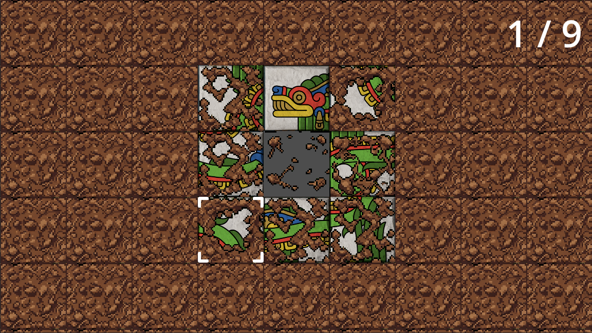
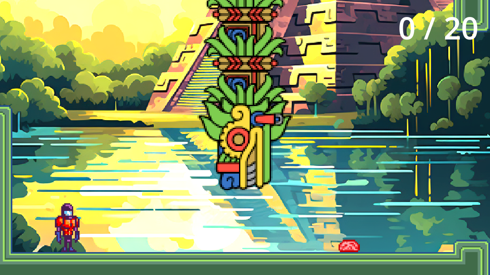

# Quetzalcoatl

A game created for **VelociCode 2026**, San Antonio’s month-long game jam.

The theme for this year’s jam is **Fossil**. This project uses [Megatroid](https://github.com/nonameentername/gba-games), one of my earlier games, as its “fossil.”

This Godot project uses [godot-csound](https://github.com/nonameentername/godot-csound/) and [godot-synths](https://github.com/nonameentername/godot-synths/).

**[Play Quetzalcoatl in your browser](https://nonameentername.github.io/quetzalcoatl/index.html)**

## Images





## Installation

### 1. Install the dependencies

Run the following commands from the project directory:

```bash
godot --headless -s package.gd install
godot --headless -s plug.gd install force
```

### 2. Import the Godot resources

```bash
godot --headless --import
```

### 3. Run the project

```bash
godot --editor project.godot
```

## Attribution

* **Quetzalcoatl artwork** by [Emmanuel Valtierra](https://www.instagram.com/emmanuelvaltierraillustrator)
* **Megatroid artwork** by [Werner Mendizabal](https://github.com/nonameentername/gba-games)
* **Chichen Itza** by [SilentEmotionn](https://www.deviantart.com/silentemotionn/art/Chichen-Itza-979036489)
* **Gerald’s Keys** by [Gerald Burke](https://gerald-burke.itch.io/geralds-keys)
